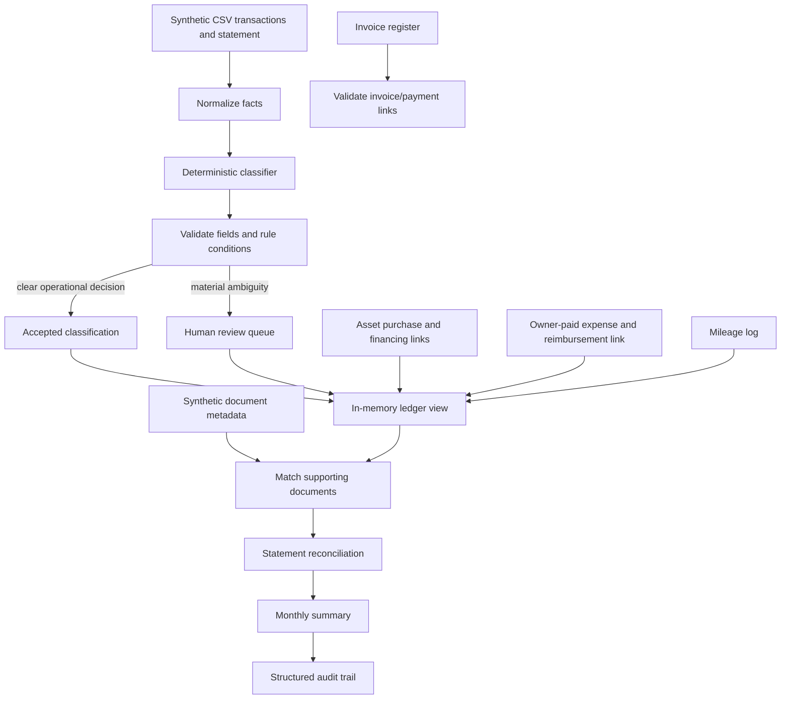

# AI-Assisted Bookkeeping Workflow

This clean-room portfolio prototype turns a natural-language bookkeeping operating procedure into explicit, testable workflow rules. It ingests synthetic transactions and document metadata, normalizes records, classifies operationally, matches evidence, reconciles a statement export, surfaces human-review questions, and produces a monthly summary with an audit trail.

It is designed to show how AI-assisted workflow systems can reduce bookkeeping friction while keeping decisions traceable. The demo is deterministic and uses no live LLM, paid service, network connection, bank feed, or real financial data.

## The problem

Bookkeeping instructions often live in conversational checklists. That makes recurring decisions hard to apply consistently: an owner-paid expense can be entered again when reimbursed, a financed laptop can be mistaken for repeated equipment purchases, an invoice can be counted before payment, or a missing receipt can silently disappear from review.

This prototype translates those instructions into structured facts, operational classifications, validation rules, reconciliation checks, and explicit review flags. It is a workflow demonstration, not accounting software for production use.

## Workflow architecture



See [docs/architecture.md](docs/architecture.md), [docs/business-rules.md](docs/business-rules.md), and [docs/privacy-boundaries.md](docs/privacy-boundaries.md) for the design details.

## What the workflow does

- Normalizes dates, counterparties, amounts, descriptions, payment sources, and supporting-document references from CSV.
- Separates operational transaction type and category from tax treatment.
- Tracks generic payment sources such as `Business Checking`, `Business Credit Card`, `Owner Personal`, `Co-owner Personal`, `Joint Personal`, `Cash`, and `Other`.
- Links a later reimbursement to the original owner-paid expense. The reimbursement is not another operating expense.
- Records an asset purchase once, preserving purchase cost/date, payment source, financing source, and document reference. Financing payments link back to the asset and do not create more asset purchases.
- Keeps invoices separate from cash transactions. Only a linked, actual income transaction contributes revenue.
- Keeps mileage in miles, separate from ordinary vehicle expenses.
- Matches document metadata, flags missing evidence, detects orphan documents, and never infers that a missing receipt exists.
- Detects likely duplicates, statement-only and ledger-only entries, payment-source mismatches, uncategorized items, and ambiguous business-use decisions.
- Generates an operational monthly summary and a structured audit event for each classification and reconciliation decision.

## Where AI fits

The current classifier is a deterministic implementation of the supplied rules. `Classifier` is a small interface; a future extraction or classification adapter could implement it. This demo does not call a model. Any future AI output should remain a proposed classification with provenance, validation, and human review for material ambiguity.

## Bookkeeping facts, classification, and tax treatment

The system preserves normalized facts independently of its classification decision. Classification answers workflow questions such as “income,” “ordinary expense,” “asset purchase,” or “transfer.” It does not decide deductibility, depreciation, Section 179, business-use tax allocation, or other tax treatment. A missing business-use percentage is never invented; if it affects classification, the record is flagged for a person to resolve.

## Synthetic monthly demo

The fictional June scenario includes ordinary expenses, income, paid and unpaid invoices, an owner-paid expense and reimbursement, a financed equipment purchase and payment, a transfer, mileage, a missing receipt, a matched receipt, a duplicate, mixed-use purchase requiring review, an unrecorded statement item, and a ledger-only item.

Example output:

```text
AUTO-ACCEPTED: 13
REVIEW REQUIRED: 1
MISSING DOCUMENTATION: 1
DUPLICATES: 1
UNRECONCILED ITEMS: 4
OUTSTANDING REIMBURSEMENTS: 1
OUTSTANDING INVOICES: 1

MONTHLY SUMMARY — 2026-06
Revenue: $1,850.00
Operating Expenses: $592.50
Net Operating Profit: $1,257.50
Asset Purchases: $2,000.00 (shown separately)
Business Mileage: 24.0 miles
Questions / Unusual Items Requiring Review: 9
```

The summary is operational bookkeeping output. Duplicate copies are excluded from totals. Review-required purchases are excluded from accepted operating totals until resolved. Asset purchases are shown separately. These figures are not a tax calculation.

## Install and run

Requires Python 3.11 or newer. The package has no runtime dependencies.

```bash
python -m venv .venv
# Windows: .venv\Scripts\activate
# macOS/Linux: source .venv/bin/activate
python -m pip install -e .
bookkeeping-demo
```

The demo writes a JSON Lines audit trail to `.local/audit.jsonl`, ignored by Git. To print the complete audit events without writing a file:

```bash
bookkeeping-demo --no-audit-file
```

Run the tests:

```bash
python -m unittest discover -s tests -v
```

## Project structure

```text
src/bookkeeping_workflow/   Models, normalization, rules, matching, reports, demo
tests/                      Synthetic business-rule tests
examples/                   Fictional transactions, statement, documents, invoices
docs/                       Architecture, rules, and privacy boundaries
diagrams/                   Standalone Mermaid architecture source
```

## Privacy and scope

Every name, vendor, amount, invoice, transaction, and document in this repository is fictional. The workflow consumes only fields needed for bookkeeping and has no bank, Drive, OCR, or remote-model integration. It does not ingest account numbers, routing numbers, tax identifiers, addresses, full statement text, or source-document contents. See [docs/privacy-boundaries.md](docs/privacy-boundaries.md).

## Limitations

- The rule-based parser expects structured CSV and document metadata; it does not perform OCR or connect to external systems.
- Matching is intentionally simple and produces review flags rather than silently resolving conflicts.
- The demo is in-memory except for the optional local audit JSONL file; it is not a multi-user ledger or a production accounting system.
- It does not determine tax treatment or replace an accountant or tax professional.
- The synthetic scenario is small and does not claim comprehensive accounting coverage.

This repository is a portfolio prototype only. It is not production accounting software, tax advice, or a replacement for professional accounting review.
