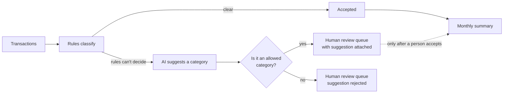

# AI-Assisted Bookkeeping Workflow

**Turning plain-English bookkeeping rules into a system that catches mistakes, and only lets AI *suggest*, never decide.**

`Status: built from the bookkeeping procedure I wrote for my own business · synthetic data · Python · 26 tests`

---

## The problem

When I set up the books for my business, the rules lived in a written checklist: *"If I buy something personally for the business and reimburse myself later, don't count the expense twice."* *"An invoice isn't revenue until the money actually arrives."* *"If something is part personal, don't guess the business percentage."*

Rules like these are easy to state and easy to break, especially at month-end, when you're tired and the same purchase shows up in three places. A plain AI chat doesn't fix that; it will happily guess. I wanted a system where **the rules are enforced the same way every time, anything uncertain is put in front of a person, and AI is only allowed to make suggestions that get checked.**

## What it catches

Run against a fictional month of transactions, it produces this:

```text
AUTO-ACCEPTED: 13
REVIEW REQUIRED: 1
  tx-mixed: category is not supported by a clear rule; mixed-use percentage is missing;
            none was inferred; AI suggests 'Office / Workshop Supplies'; confirm before accepting
MISSING DOCUMENTATION: 1
DUPLICATES: 1
  tx-software duplicates tx-software-copy
UNRECONCILED ITEMS: 4
  statement-only: st-012          <- money arrived that was never recorded
  ledger-only: tx-cash-expense
  ledger-only: tx-owner-pending
  payment-source mismatch: st-006 vs tx-travel
OUTSTANDING REIMBURSEMENTS: 1
OUTSTANDING INVOICES: 1
ORPHAN DOCUMENTS: 1               <- a receipt with no matching transaction

MONTHLY SUMMARY - 2026-06
Revenue: $1,850.00
Operating Expenses: $592.50
Net Operating Profit: $1,257.50
Asset Purchases: $2,000.00 (separate from operating totals)
Questions / Unusual Items Requiring Review: 9
```

The fictional month is built from mistakes that actually happen at month-end: a subscription entered twice, a client payment that hit the bank but never made the books, a receipt with nothing to match it to. Others are prevented by the rules rather than flagged: the reimbursement isn't counted as a second expense, the financed laptop is one purchase, and the unpaid invoice isn't counted as income.

## Where AI fits, and where it doesn't



- **Rules go first.** The model is only consulted for transactions the rules can't categorize. In the demo month, that's 1 of 15.
- **The model's answer is checked.** It must be exactly one of the allowed categories. Anything else ("Groceries, probably") is rejected and noted.
- **A suggestion is not a fact.** It's stored in its own field, labeled, and the item stays in review. Totals don't change until a person accepts it.
- **The model sees only what it needs:** vendor, description, and amount. No payment source, account, or document details.
- **If the model is offline, nothing breaks.** The workflow falls back to rules only and notes that no suggestion was available.

I could have let AI classify everything. It would look more impressive and be less trustworthy. For financial records, the right job for AI is narrowing a person's decision, not making it.

## The rules it enforces

| Rule | What goes wrong without it |
|---|---|
| Owner-paid expense is counted once; the later reimbursement links back to it | The same purchase gets counted twice |
| An asset is recorded once; financing payments link to it | A $2,000 laptop on a payment plan looks like several purchases |
| Invoices aren't revenue until linked to a real payment | Revenue is overstated by money not yet received |
| Mixed-use items never get an invented business percentage | A guessed number ends up on a tax form |
| Missing receipts are flagged, never assumed | "I'm sure I saved that" turns into an audit problem |
| Bookkeeping category is kept separate from tax treatment | The system pretends to give tax advice |

Every decision writes a structured audit event, so you can always answer *"why was this classified this way?"* Full rules: [docs/business-rules.md](docs/business-rules.md).

## Run it

Python 3.11+, no dependencies.

```bash
python -m pip install -e .
bookkeeping-demo --no-audit-file                 # rules only
bookkeeping-demo --no-audit-file --assist mock   # show the AI suggestion path offline
bookkeeping-demo --assist ollama --model qwen2.5:3b   # real suggestion from a local model
python -m unittest discover -s tests -v
```

## Limits

All names, vendors, and amounts are fictional. It reads structured CSV (no OCR or bank connections), it isn't multi-user accounting software, and it doesn't calculate taxes or replace an accountant.

---

Built by [Michael Perry](https://perry.is). I wrote the business rules and specified the behavior and tests, then directed AI coding agents to implement them and reviewed the result. [More of my work →](https://github.com/perry-is)
